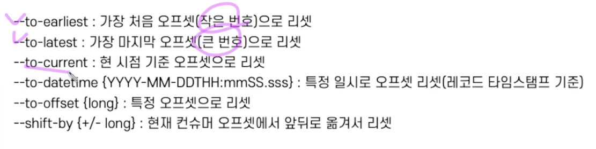

# kafka local

## kafka 커맨드

-- kafka 설치된 경로에서 실행

```bash
cd ~/99_Study/kafka_2.12-3.6.1
```

아래 에러 발생 시, 카프카 설정파일(카프카 설치 디렉토리/config/server.properties)의
log.dirs 항목에서 설정되어 있는 카프카 로그 path로 가보면
meta.properties라는 파일이 있는데 해당 파일을 지워주고 카프카를 재시작해주면 해결된다.
-> 다른 방법이 없음.

```bash
rm /Users/jack/99_Study/kafka_2.12-3.6.1/data/meta.properties

```

```text
kafka.common.InconsistentClusterIdException: The Cluster ID oeqsrV1XRxG-dgHKMRg4SA doesn't match stored clusterId Some(OsTckuzbSLaQQEgYfikh-g) in meta.properties. The broker is trying to join the wrong cluster. Configured zookeeper.connect may be wrong.
```

시작 명령어

```bash

bin/zookeeper-server-start.sh config/zookeeper.properties

bin/kafka-server-start.sh config/server.properties

```

kafka-topics 명령어

```bash

bin/kafka-broker-api-versions.sh --bootstrap-server localhost:9092

# kafka-topics.sh

bin/kafka-topics.sh --bootstrap-server localhost:9092 --list

bin/kafka-topics.sh --create --bootstrap-server my-kafka:9092 --topic hello.kafka

bin/kafka-topics.sh --bootstrap-server my-kafka:9092 --topic hello.kafka --describe

bin/kafka-topics.sh --create --bootstrap-server my-kafka:9092 --partitions 10 --replication-factor 1 --topic hello.kafka2 --config retention.ms=17280000

bin/kafka-topics.sh --create --bootstrap-server my-kafka:9092 --topic test  

bin/kafka-topics.sh --bootstrap-server my-kafka:9092 --topic test --describe

bin/kafka-topics.sh --bootstrap-server my-kafka:9092 --topic test --alter --partitions 10

```

kafka config

```bash

bin/kafka-topics.sh --bootstrap-server my-kafka:9092 --topic test --describe

bin/kafka-configs.sh --bootstrap-server my-kafka:9092 --alter --add-config min.insync.replicas=2 --topic test

bin/kafka-configs.sh --bootstrap-server my-kafka:9092 --broker 0 --all --describe


```

kafka producer - 테스트 용도로 많이 사용됨

- 같은 key를 가진 데이터는 같은 파티션에 들어간다. -> 순서 보장됨
- key를 지정하지 않으면 key가 null로 설정되며 라운드로빈으로 각 파티션에 분배됨

```bash

bin/kafka-console-producer.sh --bootstrap-server my-kafka:9092 --topic hello.kafka

bin/kafka-console-producer.sh --bootstrap-server my-kafka:9092 --topic hello.kafka --property "parse.key=true" --property "key.separator=:"


```

kafka consumer - 테스트 용도
consumer group을 사용하면 어디까지 데이터를 읽었는지 __consumer_offsets 토픽에 저장한다!

```bash

bin/kafka-console-consumer.sh --bootstrap-server my-kafka:9092 --topic hello.kafka --from-beginning

bin/kafka-console-consumer.sh --bootstrap-server my-kafka:9092 --topic hello.kafka --property print.key=true --property key.separator="-" --from-beginning

bin/kafka-console-consumer.sh --bootstrap-server my-kafka:9092 --topic hello.kafka --from-beginning --max-messages 1

bin/kafka-console-consumer.sh --bootstrap-server my-kafka:9092 --topic hello.kafka --partition 2 --from-beginning

bin/kafka-console-consumer.sh --bootstrap-server my-kafka:9092 --topic hello.kafka --group hello-group --from-beginning
-> bin/kafka-topics.sh --bootstrap-server localhost:9092 --list으로 확인해보면 __consumer_offsets 토픽에 커밋 여부가 들어가 있는 것을 확인할 수 있음 
```

kafka consumer group - kafka-console-consumer.sh --group 옵션 주었을 때, 해당 consumer group애 대한 정보를 얻을 수
있다.

```bash

bin/kafka-consumer-groups.sh --bootstrap-server my-kafka:9092 --list

bin/kafka-consumer-groups.sh --bootstrap-server my-kafka:9092 --group hello-group --describe

bin/kafka-consumer-groups.sh --bootstrap-server my-kafka:9092 --group hello-group --topic hello.kafka --reset-offsets --to-earliest --execute

```



그 외 명령어

```bash
# 카프카 프로듀서로 퍼프먼스 측정 
bin/kafka-producer-perf-test.sh --producer-props bootstrap.servers=my-kafka:9092 --topic hello.kafka --num-records 10 --throughput 1 --record-size 100 --print-metric

# 카프카 컨슈머로 퍼포먼스 측정
bin/kafka-consumer-perf-test.sh --bootstrap-server my-kafka:9092 --topic hello.kafka --messages 10 --show-detailed-stats

# 리파티셔닝 - 특정 파티션으로 리더 파티션이 쏠려 있을 때, 팔로워 파티션과 위치 변경
# 카프카 브로커에 auto.leader.rebalance.enable 옵션이 있는데 이 옵션의 기본값은 true로 클러스터 단위에서 리더 파티션을 자동 리밸런싱 해줌
-- partitions.json
{
  "partitions": [
    {
      "topic": "hello.kafka",
      "partitions": 0,
      "replicas": [0]
    }
  ],
  "version": 1
}

bin/kafka-reassign-partitions.sh --zookeper my-kafka:2181 --reassignment-json-file partitions.json --execute

# 해당 offset 이전의 데이터를 모두 삭제 
-- delete.json
{
  "partitions": [
    {
      "topic": "hello.kafka",
      "partitions": 0,
      "offset": 5
    }
  ],
  "version": 1
}
bin/kafka-delete-records.sh --bootstrap-server my-kafka:9092 --offset-json-file delete.json

# 데이터 로그 확인
bin/kafka-dump-log.sh --files data/hello.kafka-0/00000000.log --deep-iteration

```

## 토픽 생성 2가지 방법
1. 카프카 컨슈머 또는 프로듀서가 카프카 브로커에 생성되지 않은 토픽에 대해 데이터를 요청할 때 (broker의 기본 옵션으로)
-> broker를 실행할 때 topic 자동생성 여부를 true로 할 때만 생성됨
2. 커맨드 라인 툴로 명시적으로 토픽을 생성 **(추천)**


