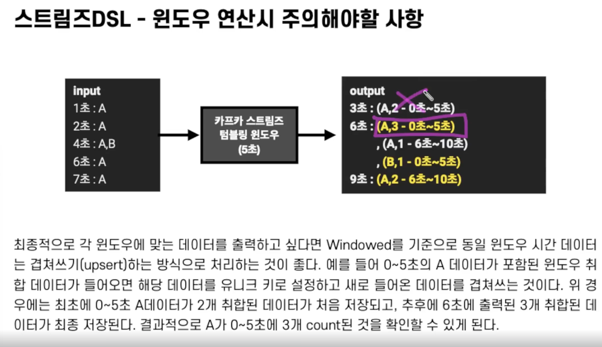
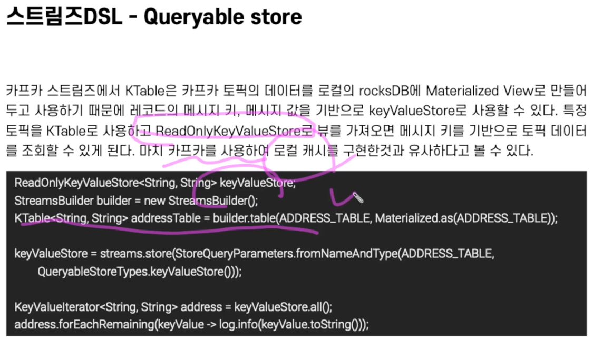

# Kafka Streams
- 카프카 스트림처리를 위한 라이브러리
- 스트림즈 라이브러리는 Exactly Once, 장애 허용 시스템(fault-tolerance)의 특징을 갖는다.
- 다만, 소스 토픽과 싱크 토픽(저장 토픽)의 카프카 클러스터가 서로 다른 경우는 스트림즈가 지원하지 않는다.

- 태스크: 파티션 개수에 맞춰서 생성, 데이터 처리 최소 단위
- applicationId: consumer-group id 와 동일한 개념
- 파티션 개수만큼 프로세스를 두고 안정적으로 운영하는 경우가 많음

- 스트림즈 DSL에는 레코드의 흐름을 추상화하는 3가지 개념을 알아야 함
  - KStream
  - KTable
  - GlobalKTable

- 코파티셔닝이란 조인을 하는 2개 데이터의 파티션 개수가 동일하고 파티셔닝 전략을 동일하게 맞추는 작업
- 파티셔닝 전략이 동일하다는 것은, Anderson이라는 key를 가진 데이터가 토픽A, 토픽 B의 각 파티션 0에 동일하게 들어가야 한다는 것을 의미함
- 코파티셔닝 되지 않은 KStream과 KTable 을 조인해서 사용하고 싶으면 KTable을 GlobalKTable로 선언하여 사용할 수 있음
- 글로벌 테일은 토픽의 전체 파티션의 모든 데이터를 MaterializedView로 각 태스크에서 사용할 수 있음
- 전체 데이터를 각각의 태스크가 가져가서 사용하기 때문에 데이터가 굉장히 클 경우 부담이 됨, GlobalKTable 의 양이 적을 때 활용할 수 있음

## 필수 옵션
- bootstrap.servers
- application.id

## 선택 옵션
- default.key.serde: 기본값 바이트 직렬화
- default.value.serde: 기본값 바이트 직렬화
- num.stream.threads: 실행될 스레드 개수, default 1.
- state.dir : 상태기반 데이터 처리를 할 때 데이터를 저장할 디렉토리 지정. default: /tmp/kafka-streams

# Streams DSL 윈도우 프로세싱
- window로 데이터 처리가 가능하다
- tumbling window : 서로 겹치지 않는 윈도우를 특정 간격으로 지속적으로 추출
- 호핑 윈도우: 큰 단위로 윈도우가 겹칠 수 있음
- sliding window: 정확한 시간을 바탕으로 윈도우 사이즈에 포함, topic에 저장된 시간을 기준으로
- 세션 윈도우: 동일 메시지 키의 데이터를 한 세션에 묶어 연산, 세션의 최대 만료시간에 따라 왼도우 사이즈가 달라짐. 윈도우 사이즈가 가변적이다.

- 윈도우 크기뿐 아니라, 커밋마다 중간 출력이 나옴. 

