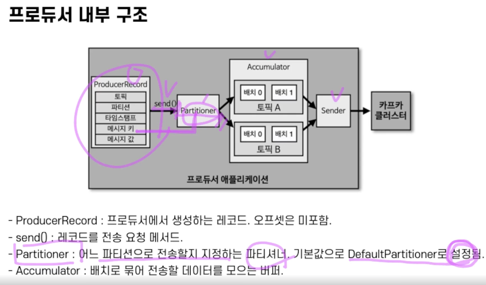

# Producer

Producer API 사용 시,
UnifromStickyPartitioner(Default) 와 RoundRobinPartitioner 2가지 파티셔너를 제공

- 메시지 키가 있을 경우 동작
  - 2가지 파티셔너 모두 메시지 키의 해시값과 파티션을 매칭하여 레코드 전송
  - 동일한 Key는 동일한 파티션으로 전송된다.(skewed 될 수 있다.)
  - 파티션 개수가 변경될 경우 메시지 키와 파티션 번호 매칭이 깨진다.
  - 파티션 개수를 여유롭게 가져가자.
- 없을 경우(null)
  - 여러 파티션에 동일하게 분배한다.
  - RoundRobin은 파티션을 순회하기 때문에 Accumulator에서 배치로 쌓아서 보내는 양이 적음
  - 이걸 배치로 묶을 때까지 기다렸다가 전송하는게 Uniform~ 파티셔너임

> 커스텀 파티셔너를 만들 수 있다. (Partitioner 인터페이스를 상속)

ex. 메시지키에 "서울"이라는 단어가 들어오면 #0 파티션으로 데이터를 보내라.

## Producer 주요 옵션

### 필수 옵션

- bootstrap.servers: 프로듀서가 데이터를 보낼 때 보내야 하는 호스트 이름:포트. 2개 이상 브로커 정보를 입력하여 일부 브로커에 이슈가 발생해도 장애 안나도록 함
- key.serializer: 메시지 키 직렬화 클래스
- value.serializer: 메시지 값 직렬화 클래스

serializer 를 할 때, StringSerializer를 쓰면 저장 용량이 늘어날 수 있지만(네트워크 비용도 증가), 왠만하면 String으로 하자.

-> String이 아닌 다른 방식으로 보내면 kafka-console-consumer에서 디버깅이 불가함

-> topic에 어떻게 직렬화되었는지 알기가 어려움 (그냥 String으로 통일하자)

### 선택 옵션
> 버전 별로 default 값이 달라지니 꼭 확인하자.

- acks 🌟 : 프로듀서가 전송한 데이터가 파티션들에 정상적으로 저장되었는지 전송 성공 여부를 확인하는 데 사용하는 옵션, 0, 1,-1(all) 중 하나로 설정 가능, default: 1
- linger.ms : 배치를 전송하기 전까지 기다리는 최소 시간. default: 0
- retries : 브로커로부터 에러를 받고 난 뒤 재전송을 시도하는 회수, 기본값: 2147483647
- max.in.flight.requests.per.connection : 한 번에 요청하는 최대 커넥션 수, 설정된 값만큼 동시에 전달 요청. default: 5
- partitioner.class : 레코드를 파티션에 전송할 때 적용하는 파티셔너 클래스. default는 DefaultPartitioner(UniformSticky~)
- enable:idempotence : 멱등성 프로듀서로 동작할지 여부. default: true (3.0부터)
- transactional.id : 프로듀서가 레코드를 전송할 때 레코드를 트랜잭션 단위로 묶을지 여부. default: null. 이걸 true로 하면 enable.idempotence 는 자동으로 true로 됨

## acks 옵션 
ISR(In-Sync-Replicas)의 상태와 관련이 있음
해당 옵션에 따라 얼마나 신뢰성이 높게 저장되는지 알 수 있음
성능과 신뢰성은 반비례
리더와 팔로워 파티션 간 싱크 정도
보통 파티션의 복제 개수(Replication Factor)를 2 이상으로 운영

- `0` : 프로듀서가 리더 파티션으로 데이터를 전송했을 때 데이터가 저장되었는지 확인하지 않고 app에 ok를 전송해줌 (app에서 send만 해도 OK)
- `1` : 리더 파티션에만 정상적으로 적재되었는지 확인하고 ok 전송
- `all` or `-1` : 리더, 팔로워 파티션에 모두 적재되었을 때 ok 전송. **토픽**의 min.insync.replicas 옵션 값에 따라 데이터 안전성이 달라진다.
2이면 leader, partition 1개만 확인하고 OK. 1이면 leader만 확인

# 멱등성 Producer

- 데이터 중복 적재를 위해 프로듀서에서 enable.idempotence 옵션을 사용하여 정확히 한 번 전달을 지원
- DEFAULT는 false임, 3.0부터는 true(acks = all).
- acks가 all이 되어 처리속도가 느려지기 때문에 유의해서 사용해야 함

- 멱등성 프로듀서는 동일한 세션에서만 정확히 한 번 전달을 보장
- 여기서 말하는 동일한 세션이란 PID의 생명주기를 의미
- 만약 멱등성 프로듀서로 동작하는 프로듀서 애플리케이션에 이슈가 발생하여 종료되고 다른 애플리케이션으로 재시작하면 PID가 달라진다.
- retries의 기본값이 Integer.MAX_VALUE로 설정되고 acks옵션은 all로 설정됨
- PID, SID를 읽는 작업 등 추가적인 리소스가 들어가긴 하지만 3.0부터 이를 처리하기 위한 로직이 개선되어 default가 됨

- 위의 경우는 거의 발생하지 않음.

-> 멱등성 프로듀서로 할 필요 없이, 애플리케이션에서 이에 대한 핸들링을 해도 됨!
